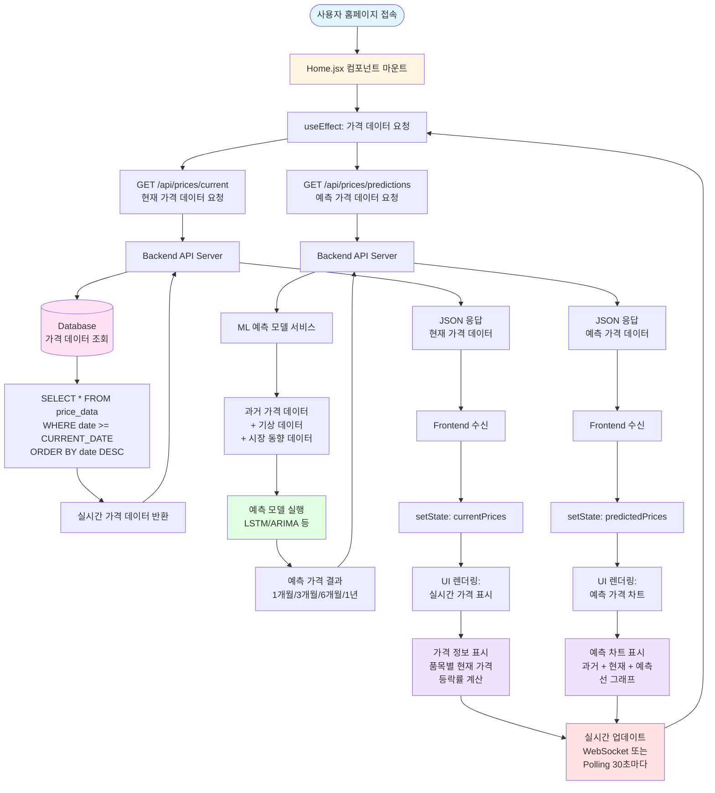
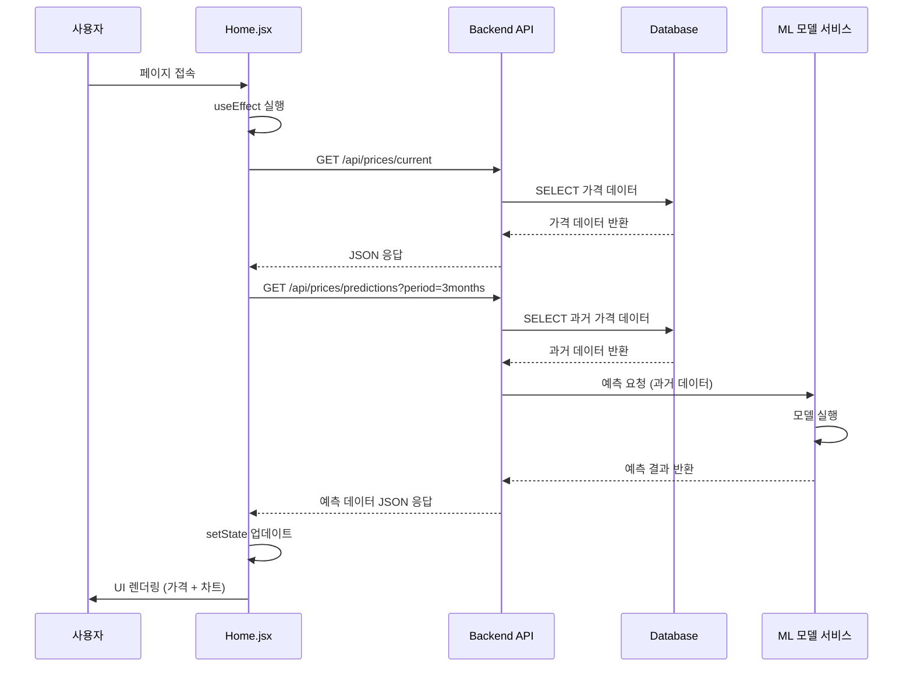
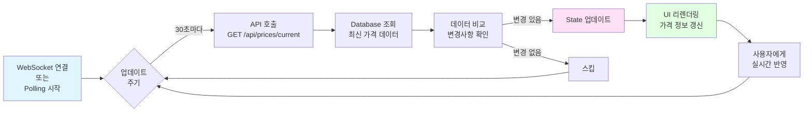
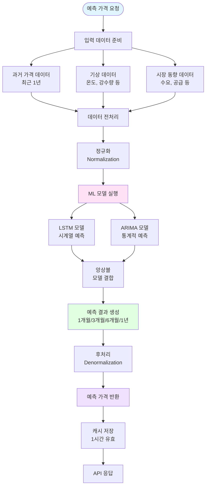
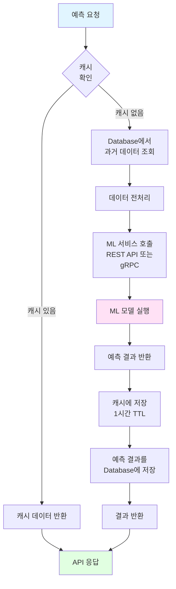

# AgriForecast 시스템 플로우차트

## 전체 시스템 데이터 흐름도



## 상세 데이터 흐름도

### 1. 초기 로딩 플로우



### 2. 실시간 업데이트 플로우



### 3. 예측 모델 실행 플로우



## 컴포넌트별 데이터 처리 플로우

### Home.jsx 데이터 처리

```mermaid
flowchart TD
    Mount[컴포넌트 마운트] --> Init[초기화]
    
    Init --> State1[useState: currentPrices = []]
    Init --> State2[useState: predictedPrices = []]
    Init --> State3[useState: loading = true]
    Init --> State4[useState: error = null]
    
    State1 --> Effect[useEffect 실행]
    State2 --> Effect
    State3 --> Effect
    State4 --> Effect
    
    Effect --> Fetch1[fetchCurrentPrices 함수]
    Effect --> Fetch2[fetchPredictedPrices 함수]
    
    Fetch1 --> API1[GET /api/prices/current]
    Fetch2 --> API2[GET /api/prices/predictions]
    
    API1 -->|성공| Update1[setCurrentPrices 데이터]
    API1 -->|실패| Error1[setError 에러 메시지]
    
    API2 -->|성공| Update2[setPredictedPrices 데이터]
    API2 -->|실패| Error2[setError 에러 메시지]
    
    Update1 --> Loading1[setLoading false]
    Update2 --> Loading2[setLoading false]
    
    Loading1 --> Render[컴포넌트 리렌더링]
    Loading2 --> Render
    
    Render --> Display1[실시간 가격 표시<br/>품목별 카드]
    Render --> Display2[예측 차트 표시<br/>Chart.js/Recharts]
    
    Display1 --> Realtime[실시간 업데이트<br/>setInterval 30초]
    Display2 --> Realtime
    
    Realtime --> Fetch1
    
    style Mount fill:#e1f5ff
    style Render fill:#e1ffe1
    style Realtime fill:#ffe1e1
```

## API 엔드포인트 설계

### 1. 현재 가격 조회 API

```
GET /api/prices/current
Query Parameters:
  - products: string[] (optional) - 품목 필터
  - limit: number (optional) - 반환 개수

Response:
{
  "success": true,
  "data": [
    {
      "productId": "cabbage",
      "productName": "배추",
      "unit": "1포기",
      "currentPrice": 3500,
      "previousPrice": 3320,
      "changeRate": 5.2,
      "changeDirection": "up",
      "lastUpdated": "2024-05-22T10:30:00Z"
    },
    ...
  ],
  "timestamp": "2024-05-22T10:30:00Z"
}
```

### 2. 예측 가격 조회 API

```
GET /api/prices/predictions
Query Parameters:
  - productId: string (required) - 품목 ID
  - period: string (required) - 예측 기간 (1month, 3months, 6months, 1year)

Response:
{
  "success": true,
  "data": {
    "productId": "cabbage",
    "productName": "배추",
    "period": "3months",
    "historical": [
      {"date": "2024-02-22", "price": 3200},
      {"date": "2024-03-22", "price": 3400},
      ...
    ],
    "current": {
      "date": "2024-05-22",
      "price": 3500
    },
    "predictions": [
      {"date": "2024-06-22", "price": 3650, "confidence": 0.85},
      {"date": "2024-07-22", "price": 3800, "confidence": 0.82},
      {"date": "2024-08-22", "price": 3750, "confidence": 0.78}
    ]
  },
  "modelInfo": {
    "modelType": "LSTM",
    "version": "1.2.0",
    "lastTrained": "2024-05-20T00:00:00Z"
  }
}
```

### 3. 실시간 업데이트 (WebSocket)

```
WebSocket: ws://api.agriforecast.com/prices/stream

Message Format:
{
  "type": "price_update",
  "data": {
    "productId": "cabbage",
    "currentPrice": 3520,
    "changeRate": 0.57,
    "timestamp": "2024-05-22T10:31:00Z"
  }
}
```

## 데이터베이스 스키마 (예시)

```sql
-- 가격 데이터 테이블
CREATE TABLE price_data (
    id BIGINT PRIMARY KEY AUTO_INCREMENT,
    product_id VARCHAR(50) NOT NULL,
    product_name VARCHAR(100) NOT NULL,
    unit VARCHAR(50) NOT NULL,
    price DECIMAL(10, 2) NOT NULL,
    date DATE NOT NULL,
    market_id VARCHAR(50),
    created_at TIMESTAMP DEFAULT CURRENT_TIMESTAMP,
    INDEX idx_product_date (product_id, date),
    INDEX idx_date (date)
);

-- 예측 데이터 테이블
CREATE TABLE price_predictions (
    id BIGINT PRIMARY KEY AUTO_INCREMENT,
    product_id VARCHAR(50) NOT NULL,
    predicted_date DATE NOT NULL,
    predicted_price DECIMAL(10, 2) NOT NULL,
    confidence_score DECIMAL(3, 2),
    model_version VARCHAR(20),
    period_type VARCHAR(20),
    created_at TIMESTAMP DEFAULT CURRENT_TIMESTAMP,
    INDEX idx_product_predicted (product_id, predicted_date)
);
```

## 실시간 업데이트 구현 방식

### 옵션 1: Polling (간단한 구현)

```javascript
// Home.jsx
useEffect(() => {
  const fetchPrices = async () => {
    try {
      const response = await fetch('/api/prices/current');
      const data = await response.json();
      setCurrentPrices(data.data);
    } catch (error) {
      console.error('가격 데이터 로딩 실패:', error);
    }
  };

  // 초기 로딩
  fetchPrices();

  // 30초마다 업데이트
  const interval = setInterval(fetchPrices, 30000);

  return () => clearInterval(interval);
}, []);
```

### 옵션 2: WebSocket (실시간 성능)

```javascript
// Home.jsx
useEffect(() => {
  const ws = new WebSocket('ws://api.agriforecast.com/prices/stream');

  ws.onmessage = (event) => {
    const update = JSON.parse(event.data);
    if (update.type === 'price_update') {
      setCurrentPrices(prev => 
        prev.map(item => 
          item.productId === update.data.productId
            ? { ...item, ...update.data }
            : item
        )
      );
    }
  };

  ws.onerror = (error) => {
    console.error('WebSocket 오류:', error);
  };

  return () => ws.close();
}, []);
```

## 예측 모델 통합 플로우



## 주요 개선 사항 요약

1. **카드 제거**: Home.jsx의 하드코딩된 가격 카드 제거
2. **실시간 데이터**: Database에서 가격 데이터를 실시간으로 조회
3. **예측 모델 통합**: ML 모델을 통해 예측 가격 생성 및 표시
4. **실시간 업데이트**: WebSocket 또는 Polling을 통한 자동 갱신
5. **성능 최적화**: 캐싱을 통한 API 응답 속도 개선


